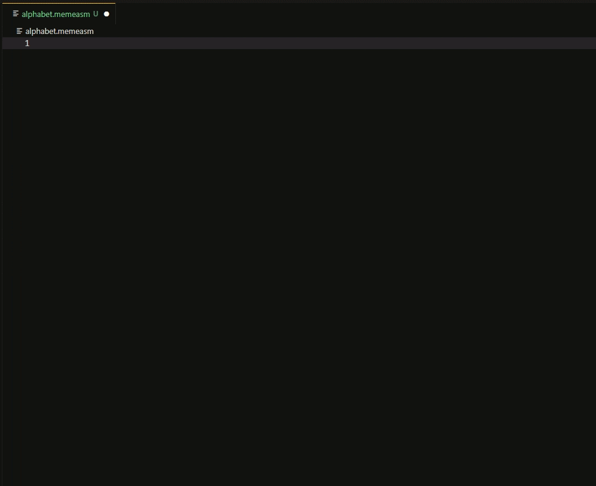
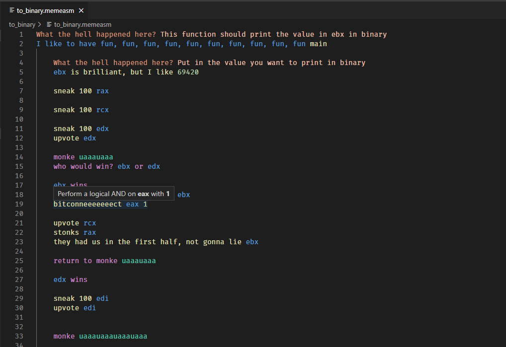

# MemeAssembly-vscode

Work in progress. Currently provides snippets and syntax highlighting.

See [vsc-extension-quickstart.md](vsc-extension-quickstart.md) on how to use. 

TL;DR: Clone, open in VSCode; then press F5 to start VSCode with this extension for debugging. A new window should open. From there, open some MemeAssembly files/directories, e.g. the one from [here](https://github.com/xarantolus/memeasm).

### Features
* Syntax highlighting
* Autocomplete snippets for most commands
* Comment toggling using shortcuts (<kbd>Ctrl</kbd>+<kbd>K</kbd>, <kbd>Ctrl</kbd>+<kbd>C</kbd> to comment current line out,  <kbd>Ctrl</kbd>+<kbd>K</kbd>, <kbd>Ctrl</kbd>+<kbd>U</kbd> to remove a comment from current line)

### Screenshots

### TODO
* Maybe support debugging using `gdb`?
